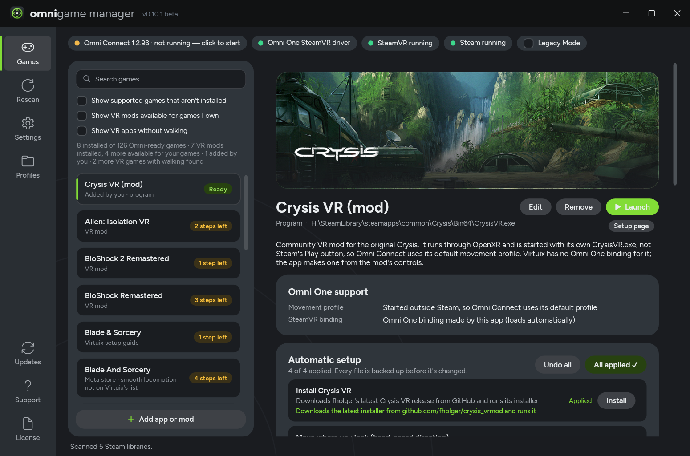
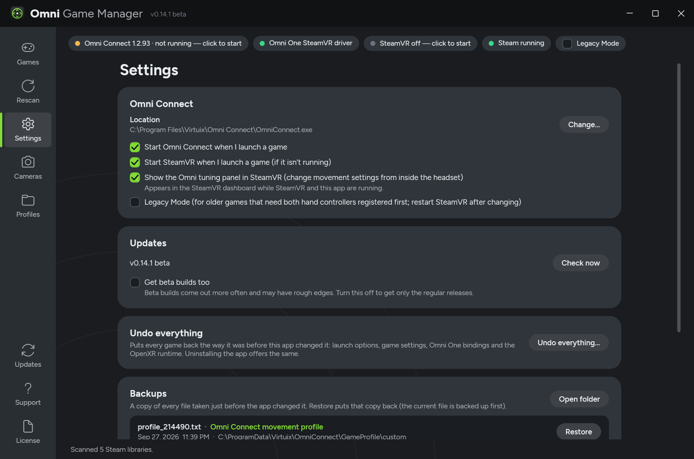
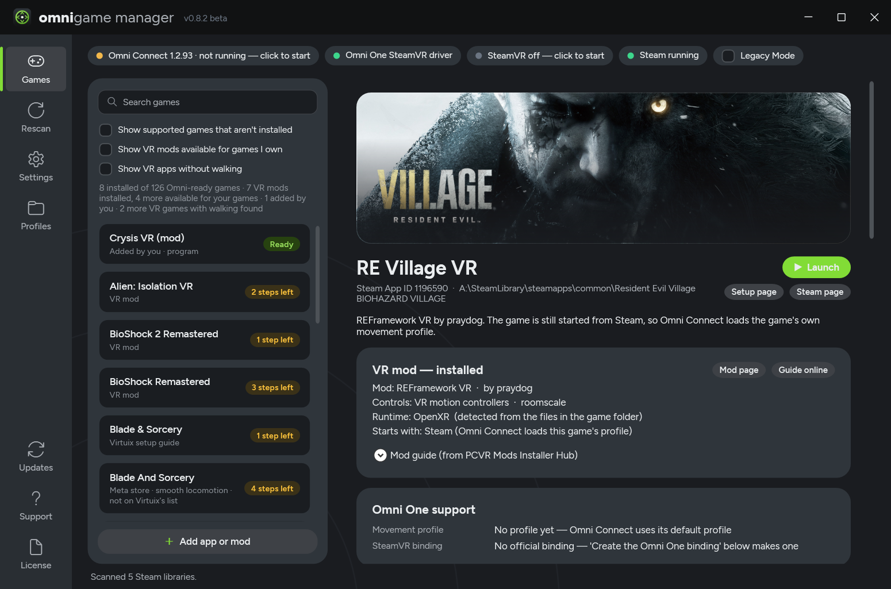
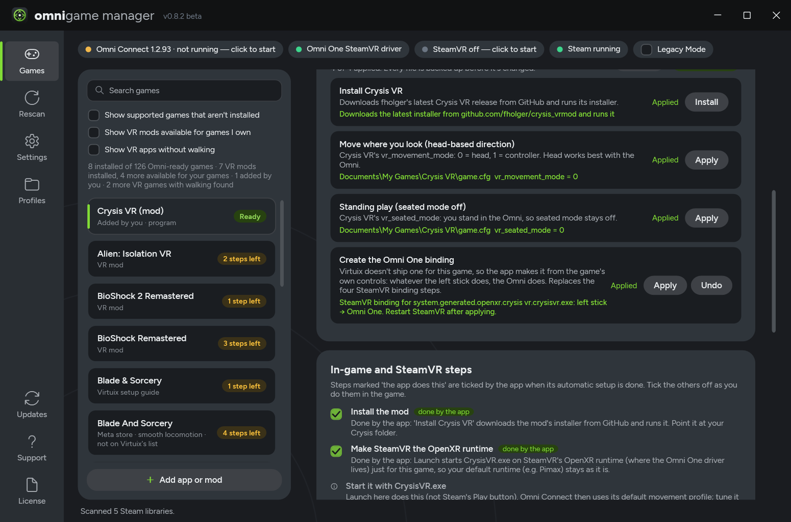
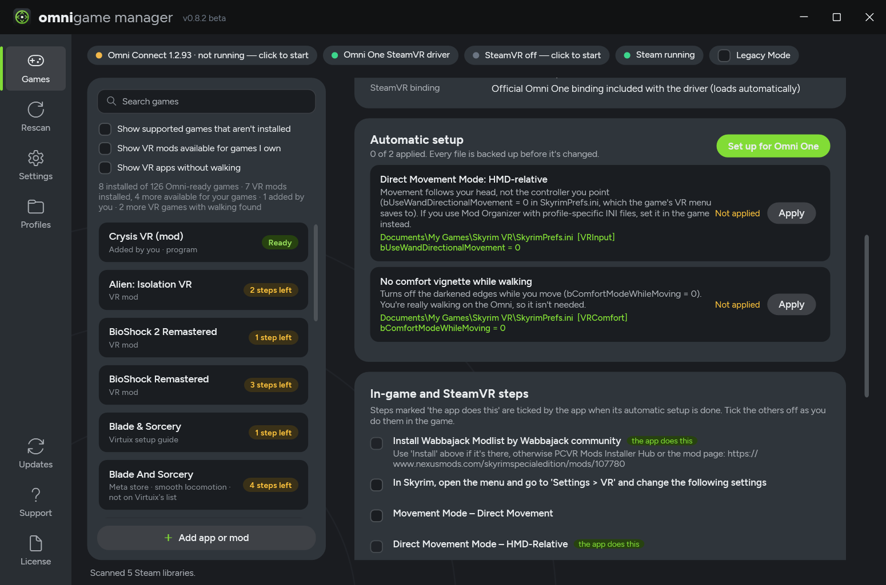
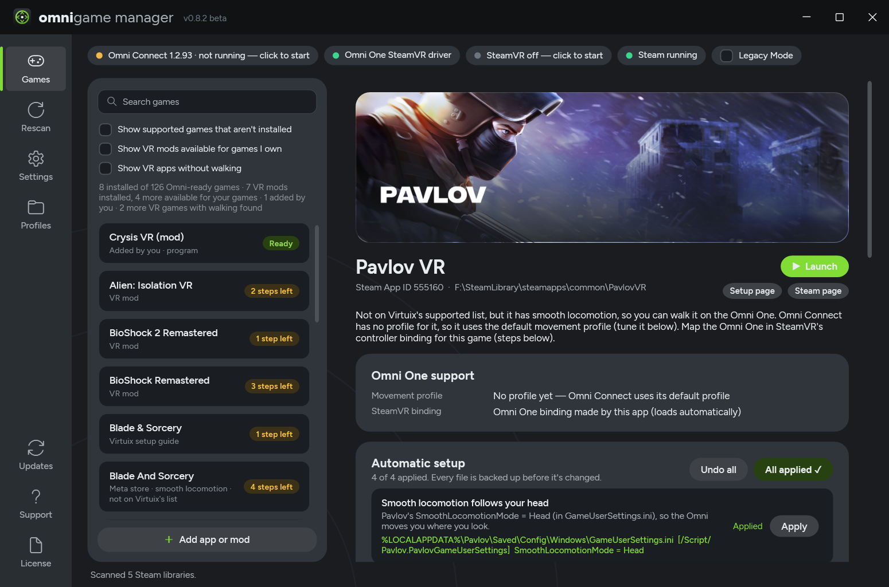
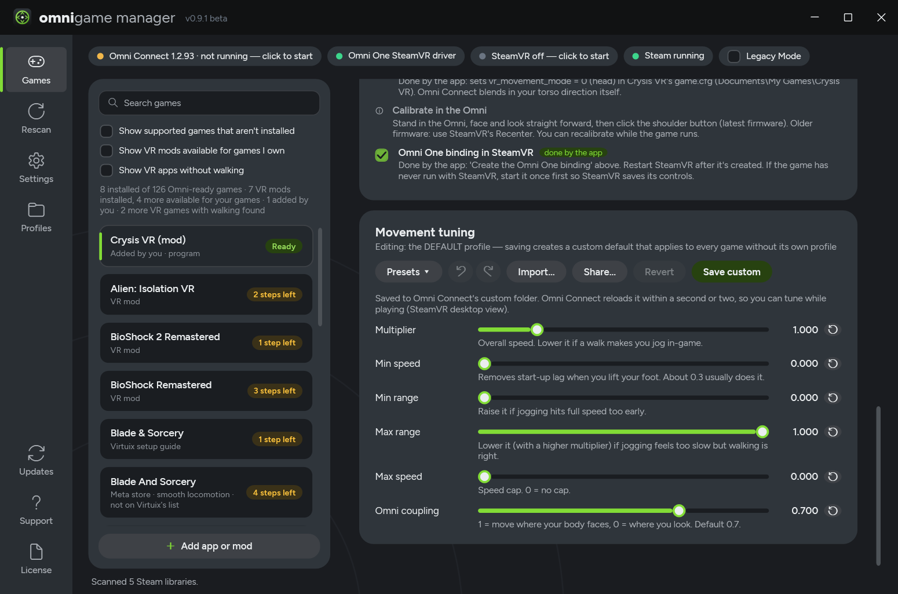
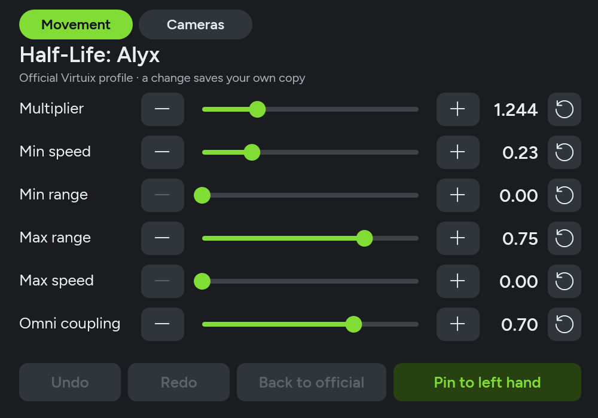



# Omni Game Manager

A free Windows app that sets up SteamVR games **and flat-to-VR mods** for the **Virtuix Omni One** treadmill.

 

  

## Download

**[⬇ Download the latest version](https://github.com/SFXShannon/omni-game-manager-releases/releases/latest)**

- **`OmniGameManager-Setup-<version>.exe`** (recommended): installs to your user folder (no admin needed), adds a Start menu shortcut and offers a desktop shortcut. Uninstall from Windows **Settings > Apps**.
- **[`OmniGameManager.exe`](https://github.com/SFXShannon/omni-game-manager-releases/releases/latest/download/OmniGameManager.exe)**: portable, no install. Run it from anywhere.

The app updates itself: click the version number at the top of the window, or accept the update when it's offered.

Windows SmartScreen may warn that it's an unrecognized app, because it isn't code-signed. Click **More info > Run anyway**.

**Requirements:** Windows 10/11 x64, Steam and SteamVR, and [Omni Connect](https://support.virtuix.com/hc/en-us/articles/32828540669837-PCVR-Software-Preparation).

## What it does

- **Finds the games on your PC that work with the Omni One**: Virtuix's 123 supported games, 280+ flat-to-VR mods (Half-Life 2 VR, the Resident Evil mods, Halo MCC VR, the GTA mods, Cyberpunk 2077 VR, Crysis VR, Alien: Isolation VR, ...), and other VR games with walking from your SteamVR library (Pavlov VR, Meta store games added to SteamVR, ...). Racing and flight sims, rhythm games and VR tools are hidden unless you ask for them.
- **Sets each game up for you** with one click ("Set up for Omni One"):
  - **Omni One binding in SteamVR** for games Virtuix doesn't ship one for, made from the game's own controls (left stick = Omni). Older SteamVR games are recognised as already covered by the Omni driver.
  - **OpenXR runtime:** OpenXR mods started from the app run on SteamVR's runtime without changing your default (e.g. Pimax); for games started through Steam it can switch the runtime for you.
  - **In-game movement settings** where the game or mod keeps them in a settings file (e.g. head-relative movement in Skyrim VR, Pavlov, Cyberpunk 2077 VR, BioShock VR, CoD4 VR, Crysis VR and UEVR games), so you don't have to find them in menus.
  - **Steam launch options** a game needs (e.g. Half-Life: Alyx's walking speed), **game settings** it knows (e.g. Crysis VR's head-based movement), Omni Connect profile copies, and **mod installers** from GitHub.
- **Undo all:** puts a game back exactly the way it was before the app changed it. **Undo everything** (in Settings) does it for every game, and uninstalling the app offers the same.
- **Backups with Restore:** every file is backed up before the app changes it, and each backup can be restored from Settings.
- **Checklist** of what's left for you, like in-game menu settings, which the app ticks off itself where it can.
- **Tunes movement** in Omni Connect's game profile (live while you play), with presets, undo and **community profiles** that update online.
- **Tune from inside the headset:** an **Omni tuning** tab in the SteamVR dashboard edits the running game's movement settings, and changes apply within a second or two. **Pin to left hand** keeps the panel on your controller so you can keep walking while you adjust. Use **Share…** in the app to add yours to the [shared list](community/profiles.json); it goes through a quick check first.
- **Launches** the game the right way, starting SteamVR and Omni Connect first and adding any Steam launch options it still needs.
- **Warns you** about things that stop the Omni from working, such as the wrong OpenXR runtime or Legacy Mode.
- **Looks at home next to Omni Connect**, with each game's artwork on its page, and updates itself from this page (tick "Get beta builds too" in Settings for pre-releases).

## Problems and ideas

The app is in **beta**. Click **Support** in the app (or **Copy diagnostics** in Settings): it copies a short report about your setup to paste into an [issue](../../issues/new/choose).

## License

Omni Game Manager is **free to use but not open source**. Copyright (c) 2026 SFXShannon. All rights reserved.
See the [license agreement](LICENSE). Third-party material is listed in [THIRD_PARTY_NOTICES.md](THIRD_PARTY_NOTICES.md).

This repository contains releases only; the source code is not public.

Omni Game Manager is an unofficial tool. It is not made, endorsed or supported by Virtuix. Omni One and Omni Connect are trademarks of Virtuix.
